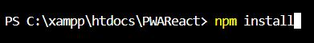

# Trabajo Practico React
Trabajo práctico de React de la materia Programación Web Avanzada.

## Lista de tareas
El objetivo es crear una aplicación que sirva como anotador
de una lista de tareas, permitiendo que el usuario agregue tareas,
las marque como completadas y pueda eliminarlas.

## Integrantes:
Nicolás Maldonado FAI-3196

Thomas Rifo FAI-4296

Marco Pistagnesi FAI-4407

## Función de archivos iniciales:

### `index.js`
Importa archivos como App y ReactDOM y es utilizado para las
configuraciones globales necesarias de la aplicación.

### `index.css`
Sirve para los estilos CSS globales que pueda tener nuestro proyecto.

### `App.js`
Estructura principal de la aplicación, lo que debería verse a través
de un navegador.

### `package-json.js`
Guarda las dependencias de la aplicación necesarias para ejecutarse
de forma correcta.

## Instrucciones
• Clonar el repositorio desde la terminal:

• Ejecutar el comando `npm install` para instalar las dependencias.

Es necesario tener node.js instalado. Se puede descargar desde nodejs.org

• Ejecutar el comando `npm start` para iniciar la aplicación.

Se puede acceder escribiendo localhost:3000 en el navegador.

